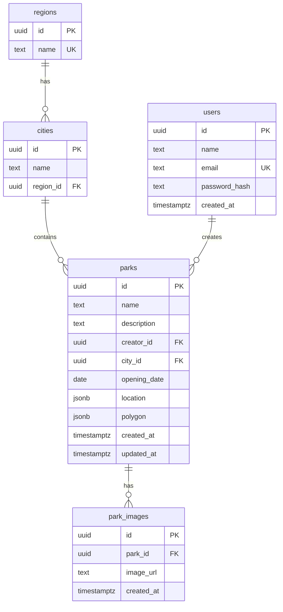

# Park Explorer

אפליקציית ניהול וחיפוש פארקים — רשימה, מפה, סינון, ו-CRUD מלא מאחורי הרשמה והתחברות.
מונוריפו Turborepo עם לקוח ושרת מוקלדים מקצה לקצה דרך tRPC: טיפוס שמשתנה בשרת שובר קומפילציה בלקוח.

פרויקט לימוד. הקוד כתוב במלואו בידי בעל הפרויקט, שלב אחרי שלב.

---

## תוכן

- [מה האפליקציה עושה](#מה-האפליקציה-עושה)
- [ארכיטקטורה](#ארכיטקטורה)
- [מבנה המונוריפו](#מבנה-המונוריפו)
- [התקנה והרצה](#התקנה-והרצה)
- [משתני סביבה](#משתני-סביבה)
- [פקודות](#פקודות)
- [מודל הנתונים](#מודל-הנתונים)
- [חוזה ה-API](#חוזה-ה-api)
- [טיפול בשגיאות](#טיפול-בשגיאות)
- [מלכודות ידועות](#מלכודות-ידועות)
- [מה עדיין לא קיים](#מה-עדיין-לא-קיים)

---

## מה האפליקציה עושה

- **הרשמה והתחברות** — סיסמה מגובבת ב-bcrypt, טוקן JWT שנשמר בדפדפן. כל המסכים הפנימיים יושבים מאחורי שומר ניתוב.
- **מסך ראשי דו-חלוני** — רשימת פארקים בצד אחד, מפה אינטראקטיבית בשני. שתי החלוניות קוראות את אותה שאילתה בדיוק, כלומר בקשה אחת ורשומת מטמון אחת.
- **סינון** — חיפוש חופשי בשם (עם השהיה), מחוז, ועיר שמצטמצמת למחוז הנבחר. מצב הסינון והפארק הנבחר חיים בכתובת ה-URL, כך שקישור משוחזר בדיוק כפי שנשלח.
- **מפה** — סמנים וקטוריים, גבולות פוליגון היכן שקיימים, פופאפ עם קישור לפרטים, ומעוף אל הפארק הנבחר. בחירה בכל צד מסונכרנת לצד השני.
- **מסך פארק** — פרטים מלאים, מפה ממוקדת, ועריכה או מחיקה — למי שיצר את הפארק בלבד.
- **מצב כהה** — נבחר ידנית, נשמר, ומוחל עוד לפני הרינדור הראשון כדי שלא יהבהב.

---

## ארכיטקטורה

```
┌──────────────────────────── apps/web ────────────────────────────┐
│  React 19 · Vite · Tailwind v4 · shadcn (base-nova / Base UI)    │
│                                                                  │
│  routes/       TanStack Router — ניתוב מבוסס קבצים               │
│  features/     auth · filters · map · parks                      │
│  stores/       Zustand — הטוקן, ורק הוא                          │
│  lib/trpc.ts   לקוח tRPC + טיפוסי הפלט של כל פרוצדורה            │
└──────────────────────────────────┬───────────────────────────────┘
                                   │  HTTP  ·  /trpc
                                   │  Authorization: Bearer <jwt>
┌──────────────────────────────────┴───────────────────────────────┐
│                            apps/api                              │
│  NestJS 11 · nestjs-trpc · Express                               │
│                                                                  │
│  *.router.ts    שכבת התעבורה — @Query / @Mutation                │
│  *.schemas.ts   חוזה Zod: קלט ופלט                               │
│  *.service.ts   לוגיקה עסקית — לא מכירה HTTP כלל                 │
│  common/        שגיאות דומיין + מידלוור שממפה אותן               │
│  auth/          מידלוור טוקן, JWT, bcrypt                        │
└──────────────────────────────────┬───────────────────────────────┘
                                   │  Drizzle ORM
┌──────────────────────────────────┴───────────────────────────────┐
│                          packages/db                             │
│  סכימה · מיגרציות · זריעה · יצרן חיבור. אפס תלות בפריימוורק      │
└──────────────────────────────────┬───────────────────────────────┘
                                   │  pg Pool
                              Postgres (Neon)
```

### איך הטיפוסים עוברים מהשרת ללקוח

זו הנקודה המרכזית בארכיטקטורה, ולכן היא כתובה כאן במפורש:

1. סכימות Zod בשרת מגדירות קלט ופלט לכל פרוצדורה, בקבצים

   ```
   apps/api/src/**/*.schemas.ts
   ```

2. הפקודה

   ```bash
   npm run trpc:generate
   ```

   מייצרת קובץ חוזה יחיד:

   ```
   apps/api/src/@generated/server.ts
   ```

   הקובץ מכיל את מבנה ה-router ואת הטיפוסים בלבד — הגוף של כל פרוצדורה הוא placeholder.

3. הלקוח מייבא ממנו את הטיפוס

   ```
   AppRouter
   ```

   דרך כינוי הנתיב

   ```
   @server/*  →  apps/api/src/*
   ```

   המוגדר בקובץ `tsconfig.app.json` של הלקוח. זהו ייבוא טיפוסים נטו, ולכן שום קוד שרת לא נכנס לחבילת הלקוח.

**הקובץ המיוצר אינו מתרענן מעצמו.** שרת הפיתוח לא מייצר אותו. אחרי כל שינוי בדקורטור
`@Query` או `@Mutation`, וגם אחרי כל שינוי שם או מיקום של קובץ סכימה — יש להריץ שוב את
`npm run trpc:generate`. הקובץ מכיל נתיבי מקור קשיחים, ולכן שינוי שם שובר אותו עד לייצור מחדש.

---

## מבנה המונוריפו

```
PARK-EXPLORER/
├── apps/
│   ├── api/          שרת NestJS + tRPC        → apps/api/README.md
│   └── web/          לקוח React + Vite        → apps/web/README.md
├── packages/
│   └── db/           סכימה, מיגרציות, זריעה   → packages/db/README.md
├── .env              קובץ אחד לכל המונוריפו (לא נכנס ל-git)
├── .env.example
├── turbo.json        הגדרת המשימות והתלויות ביניהן
└── package.json      workspaces: apps/* , packages/*
```

לכל אחת משלוש החבילות יש README משלה עם הפירוט הפנימי.

### תלויות בין החבילות

```
web  ──(טיפוסים בלבד, דרך @server/*)──▶  api  ──(תלות חבילה)──▶  @park-explorer/db
```

התיקייה `apps/api` צורכת את חבילת המסד **בנויה**, מתוך `dist`, ולא כמקור. משמעות מעשית: שינוי
בקובץ סכימה אינו משפיע על השרת בזמן ריצה עד שהחבילה נבנית מחדש. תחת

```bash
npm run dev
```

זה קורה מעצמו, כי לחבילת המסד יש סקריפט `dev` שהוא `tsc --watch`.

התיקייה `apps/web` תלויה בשרת ברמת הטיפוסים בלבד, ולכן אינה מופיעה כתלות ב-`package.json` שלה
ואינה מחייבת בנייה של השרת לפניה.

---

## התקנה והרצה

דרישות: Node 18 ומעלה, npm, ומסד Postgres — הפרויקט מכוון ל-Neon.

```bash
npm install
```

צרו קובץ `.env` בשורש המונוריפו לפי `.env.example`, ואז:

```bash
npm run db:migrate
```

```bash
npm run db:seed
```

```bash
npm run dev
```

- לקוח: http://localhost:5173
- שרת: http://localhost:3000 — נקודת הקצה היא `/trpc`

הזריעה יוצרת 4 מחוזות ו-14 ערים. היא משתמשת ב-`onConflictDoNothing`, ולכן הרצה חוזרת שלה בטוחה.

---

## משתני סביבה

קובץ `.env` **אחד** בשורש המונוריפו משרת את השרת, את חבילת המסד ואת הלקוח.
שני התהליכים העצמאיים — `drizzle-kit` וסקריפט הזריעה — טוענים אותו בעצמם מנתיב יחסי, ולכן
המיקום בשורש אינו מקרי.

| משתנה                   | נדרש | מי קורא       | תפקיד                                      |
| ----------------------- | ---- | ------------- | ------------------------------------------ |
| `DATABASE_URL`          | כן   | שרת, זריעה    | חיבור Neon **pooled**, לזמן ריצה           |
| `DATABASE_URL_UNPOOLED` | כן   | `drizzle-kit` | חיבור Neon **direct**, למיגרציות ול-Studio |
| `JWT_SECRET`            | כן   | שרת           | סוד חתימת הטוקנים                          |
| `PORT`                  | לא   | שרת           | ברירת מחדל 3000                            |
| `VITE_TRPC_URL`         | לא   | לקוח          | ברירת מחדל `http://localhost:3000/trpc`    |

השרת מאמת את הסביבה בעלייה, בסכימת Zod שיושבת בקובץ

```
apps/api/src/config/config.ts
```

משתנה חסר מפיל את התהליך מיד, עם שם המשתנה החסר, ולא מאוחר יותר בתוך בקשה אקראית.

---

## פקודות

כולן מהשורש. כל אחת עוברת דרך Turborepo אל החבילות הרלוונטיות.

```bash
npm run dev              # web + api + tsc --watch של חבילת המסד
npm run build            # בונה את שלוש החבילות בסדר הנכון
npm run lint             # eslint
npm run check-types      # בדיקת טיפוסים ללא פלט
npm run format           # prettier על כל ts/tsx/md
```

```bash
npm run trpc:generate    # מרענן את חוזה tRPC — אחרי כל שינוי ב-@Query/@Mutation
```

```bash
npm run db:generate      # מפיק קובץ SQL של מיגרציה מתוך הסכימה
npm run db:migrate       # מריץ את המיגרציות שטרם רצו
npm run db:seed          # מחוזות וערים
npm run db:studio        # Drizzle Studio — עיון חזותי במסד
```

משימות המסד וייצור החוזה מוגדרות בקובץ `turbo.json` עם `cache: false`, כי הפלט שלהן הוא מצב
חיצוני ולא קובץ בתיקייה.

---

## מודל הנתונים



נקודות שכדאי לדעת:

- **גאומטריה כ-JSONB.** השדה `location` הוא GeoJSON מסוג `Point`, והשדה `polygon` הוא `Polygon`. שניהם מוקלדים דרך `$type<>()` של Drizzle. אין PostGIS, ולכן אין שאילתות מרחביות במסד — הסינון טקסטואלי ולפי מפתחות.
- **סדר הקואורדינטות.** תקן GeoJSON כותב אורך לפני רוחב, ו-Leaflet הפוך. ההיפוך מרוכז בפונקציה אחת בלבד, בקובץ `apps/web/src/features/map/lib/geo.ts`.
- **מדיניות מחיקה.** מחוז, עיר ומשתמש הם `restrict` — אי אפשר למחוק ישות שתלויות בה שורות. תמונות הפארק הן `cascade`, ונמחקות יחד איתו.
- **ייחודיות.** שם עיר ייחודי בתוך מחוז, לא ברמת המדינה. שם מחוז וכתובת אימייל ייחודיים גלובלית.
- **החותמת `updated_at`** מתעדכנת לבדה — היא מוגדרת עם `$onUpdate` בסכימה.

---

## חוזה ה-API

| Router          | פרוצדורה       | סוג      | טוקן   | מה זה עושה                                                      |
| --------------- | -------------- | -------- | ------ | --------------------------------------------------------------- |
| `authRouter`    | `register`     | mutation | לא     | יוצר משתמש, מחזיר טוקן                                          |
| `authRouter`    | `login`        | mutation | לא     | מאמת סיסמה, מחזיר טוקן                                          |
| `authRouter`    | `me`           | query    | **כן** | המשתמש המחובר: מזהה, שם, אימייל                                 |
| `regionsRouter` | `findAll`      | query    | לא     | כל המחוזות                                                      |
| `citiesRouter`  | `findByRegion` | query    | לא     | ערי מחוז                                                        |
| `parksRouter`   | `findAll`      | query    | לא     | רשימה מסוננת — `search`, `regionId`, `cityId`, כולן אופציונליות |
| `parksRouter`   | `findById`     | query    | לא     | פארק בודד                                                       |
| `parksRouter`   | `create`       | mutation | **כן** | יוצר פארק; היוצר נלקח מהטוקן ולא מגוף הבקשה                     |
| `parksRouter`   | `update`       | mutation | **כן** | עדכון חלקי — **בעלים בלבד**                                     |
| `parksRouter`   | `remove`       | mutation | **כן** | מחיקה — **בעלים בלבד**; מחזיר את המזהה                          |
| `healthRouter`  | `health`       | query    | לא     | בדיקת חיים                                                      |

ההרשאה נאכפת במידלוור `AuthMiddleware` ברמת הפרוצדורה, וכלל הבעלות נאכף בתוך `ParksService` —
כלומר בלוגיקה, ולא בשכבת התעבורה. הסתרת כפתורי העריכה בלקוח היא נימוס בלבד; האכיפה האמיתית בשרת.

**שאילתות הפארקים פתוחות בכוונה.** הן אינן דורשות טוקן, אף שבלקוח הן יושבות מאחורי שומר הניתוב.
מי שירצה לסגור גם אותן יוסיף להן `@UseMiddlewares(AuthMiddleware)`.

---

## טיפול בשגיאות

שרשרת אחת מקצה לקצה, שכל חוליה בה מכירה רק את שכנתה:

```
Service
    זורק שגיאת דומיין — NotFoundError, ForbiddenError, ConflictError,
    UnauthorizedError, InvalidInputError. לא יודע מה זה HTTP.
        ↓
DomainErrorsMiddleware
    מידלוור גלובלי אחד. ממפה כל שגיאת דומיין לקוד tRPC: NOT_FOUND,
    FORBIDDEN, CONFLICT, UNAUTHORIZED, BAD_REQUEST. כל השאר →
    INTERNAL_SERVER_ERROR.
        ↓
lib/errors.ts  (לקוח)
    קוד → משפט לקורא. כאן, ורק כאן, נקבע כל טקסט שגיאה שהמשתמש רואה.
    מסך יכול לדרוס קוד מסוים שמשמעותו אצלו ספציפית.
        ↓
lib/query-client.ts  (לקוח)
    קוד שהוא "תשובה" ולא "תקלה" לא מנוסה שוב. קוד UNAUTHORIZED בכל בקשה
    שהיא מנתק את המשתמש — פעם אחת, במקום אחד.
```

השרת זורק את שגיאות הדומיין ללא הודעת טקסט, כדי שהניסוח לא יתפצל לשני מקומות.

---

## מלכודות ידועות

- **הספרייה `nestjs-trpc` בגרסה 2 אינה מייצרת בזמן ריצה.** הייצור הוא כלי CLI עצמאי. ראו את הפסקה על מעבר הטיפוסים למעלה.
- **תהליכי `nest start --watch` יתומים.** עצירת שרת הפיתוח הורגת רק את התהליך הפנימי; העטיפה והצופה שורדים, מחזיקים את פורט 3000, ומעלים שרת מחדש בשינוי הקובץ הבא. אבחון:

  ```bash
  netstat -ano | grep ":3000 " | grep -i LISTEN
  ```

  יש להרוג את כל עץ התהליכים ולוודא אפס תהליכי `node.exe` לפני הרצה מחדש.

- **קובץ `.tsbuildinfo` תקוע.** מטמון בנייה מצטבר ששוכן מחוץ ל-`dist` שורד את `deleteOutDir`, ויכול לגרום לבנייה לא לפלוט דבר ולצאת בקוד 0. אם בנייה נראית מהירה מדי, או ש-Turborepo מתלונן על פלט חסר — זה החשוד הראשון.
- **חבילת המסד נצרכת בנויה.** שינוי בסכימה שאינו נראה בשרת — בדקו קודם שהוא קיים בתוך `packages/db/dist`.
- **התקנת חבילה בזמן ששרת Vite רץ** עלולה להפיל את הלקוח בשגיאה שנראית כמו שני עותקים של React. יש לכבות את שרת הפיתוח לפני התקנה.
- **סדר הזרקת ה-CSS של Leaflet.** גיליון הסגנונות של Leaflet מיובא מתוך רכיב המפה, ולכן Vite מזריק אותו **אחרי** `index.css`. בעימות בסלקטיביות שווה הוא מנצח על סדר בלבד. לכן כל דריסה של סגנון Leaflet בפרויקט תחומה תחת `.leaflet-container`.

---

## מה עדיין לא קיים

הרשימה כאן כדי שלא תצטרכו לגלות את זה לבד:

- **אין בדיקות אוטומטיות.** תשתית Jest מוגדרת בשרת, אבל אין ולו קובץ `*.spec.ts` אחד. פקודת הבדיקות תרוץ על אפס בדיקות.
- **הטבלה `park_images` קיימת בסכימה ואין לה שימוש.** אין העלאת תמונות, אין פרוצדורה, ואין ממשק. הטבלה והקשר מוכנים בלבד.
- **הטוקן חי 15 דקות ואין רענון.** בתום הזמן הבקשה הבאה מחזירה `UNAUTHORIZED`, והלקוח מנתק את המשתמש למסך ההתחברות. זה מכוון, אבל שווה לדעת לפני הדגמה ארוכה.
- **השדה `polygon` נקרא ומצויר, אך אינו נכתב.** הטופס אינו מאפשר לשרטט גבול; פוליגונים מגיעים למסד בדרך אחרת.
- **ניקוי שדה טקסט בעריכה אינו מוחק אותו.** תיאור או תאריך פתיחה שרוקנו נשלחים כ-`undefined`, כלומר נושרים מגוף הבקשה, והשרת משאיר את הערך הישן. מחיקה אמיתית דורשת `nullable` בסכימת העדכון.
- **מדיניות CORS פתוחה לכל מקור** — קריאה ל-`app.enableCors()` ללא הגבלה. מתאים לפיתוח, לא לייצור.
- **הקובץ `.env` נטען מנתיב יחסי** — `../../.env` ביחס לתיקיית העבודה. הרצה מתיקייה אחרת לא תמצא אותו.
