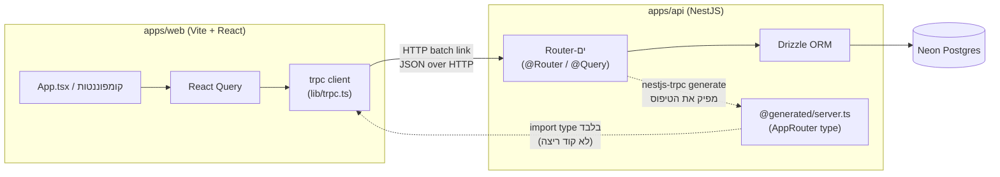
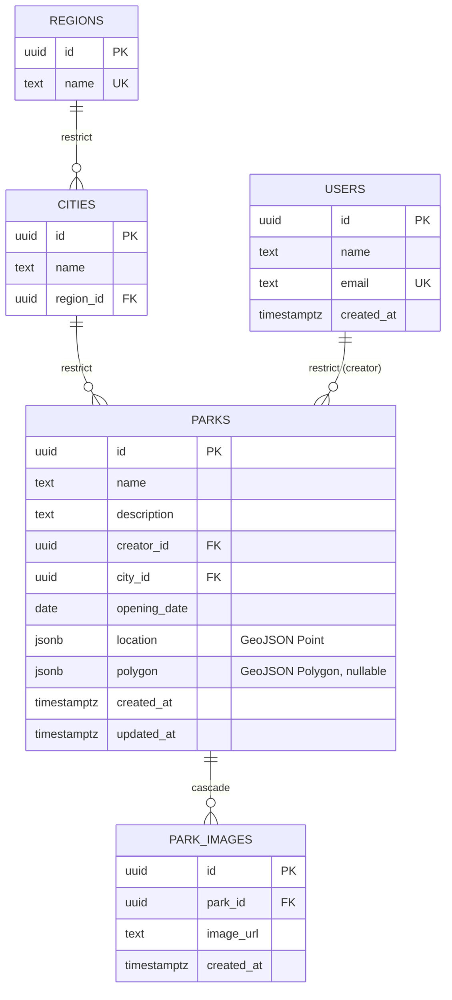

# מדריך הפרויקט שלב א-ב — Park Explorer

> **מטרת המסמך:** לתת לך תמונה מלאה של מה שנבנה עד כה — הארכיטקטורה, ההחלטות שהתקבלו ולמה, מה יכול היה להיות אחרת, איך מריצים ומפתחים, ואיך לעבור בעצמך על הקוד ולשלוט בו. המסמך נכתב ע"י Claude כסקירה של קוד קיים — **הוא לא מחליף את זה שאתה עצמך תעבור על כל קובץ** (ראה סעיף 9, "מעבר על הקוד בעצמך").
>
> נכתב: 2026-08-18, אחרי סיום בפועל של שלב ב' (B.1–B.6). שלב א' ממוזג ל-`main`; שלב ב' עדיין רק על `dev`.

---

## תוכן עניינים

1. [תמונת-על](#1-תמונת-על)
2. [מבנה התיקיות](#2-מבנה-התיקיות)
3. [שלב א' — התשתית: מונוריפו, tRPC, React Query](#3-שלב-א--התשתית-מונוריפו-trpc-react-query)
4. [שלב ב' — מודל הנתונים: Drizzle ו-Neon](#4-שלב-ב--מודל-הנתונים-drizzle-ו-neon)
5. [דיאגרמת מודל הנתונים (ER)](#5-דיאגרמת-מודל-הנתונים-er)
6. [טבלת ההחלטות הארכיטקטוניות — ומה יכול היה להיות אחרת](#6-טבלת-ההחלטות-הארכיטקטוניות--ומה-יכול-היה-להיות-אחרת)
7. [מיפוי מושגים ל-FastAPI](#7-מיפוי-מושגים-ל-fastapi)
8. [איך מריצים ומפתחים](#8-איך-מריצים-ומפתחים)
9. [מעבר על הקוד בעצמך](#9-מעבר-על-הקוד-בעצמך)
10. [מלכודות ידועות בפרויקט הזה](#10-מלכודות-ידועות-בפרויקט-הזה)
11. [מצב נוכחי ומה חסר](#11-מצב-נוכחי-ומה-חסר)

---

## 1. תמונת-על

Park Explorer הוא מונוריפו (repo יחיד עם כמה אפליקציות) שמנוהל ע"י **Turborepo**. שתי אפליקציות תחת `apps/`:

- **`apps/web`** — לקוח: Vite + React 19 + TypeScript, עיצוב עם Tailwind CSS v4 ו-shadcn/ui.
- **`apps/api`** — שרת: NestJS, עם `nestjs-trpc` שמחבר tRPC לתוך מערכת המודולים של Nest, ו-Drizzle ORM מול Postgres (Neon).

הרעיון המרכזי שמחבר את השניים: **קצה-לקצה מוקלד (end-to-end type safety) בלי לכתוב טיפוסים פעמיים.** במקום שהלקוח יכתוב טיפוסי TypeScript ידניים שמתארים את ה-API של השרת (ושיכולים להתיישן ברגע שהשרת משתנה), הלקוח מייבא **טיפוס בלבד** (`import type`) מקובץ שנוצר אוטומטית מתוך קוד השרת. אם משהו בשרת משתנה בצורה שלא תואמת את מה שהלקוח מצפה לו — TypeScript יצעק על זה בזמן קומפילציה, לא בזמן ריצה.



נקודה חשובה: החץ המקווקו מ-`@generated/server.ts` ללקוח הוא **טיפוס בלבד**, לא קוד. זו החלטה מכוונת (ראה סעיף 6, החלטה על אבטחה) — כדי שקוד מהבאקנד (למשל, לוגיקה עסקית, סודות) לא "ידלוף" בטעות לתוך ה-bundle של הפרונט.

---

## 2. מבנה התיקיות

```
PARK-EXPLORER/
├── apps/
│   ├── api/                          # שרת NestJS
│   │   ├── src/
│   │   │   ├── @generated/server.ts  # AUTO-GENERATED — לא לגעת ידנית
│   │   │   ├── app.module.ts         # המודול השורש
│   │   │   ├── main.ts               # נקודת הכניסה (bootstrap)
│   │   │   ├── health/
│   │   │   │   └── health.router.ts  # ה-router היחיד שקיים כרגע
│   │   │   └── database/
│   │   │       ├── database.module.ts
│   │   │       ├── database.providers.ts
│   │   │       ├── schema/           # טבלאות Drizzle + relations
│   │   │       └── seed/             # סקריפט אתחול + נתוני מקור
│   │   ├── drizzle/                  # SQL שנוצר ע"י drizzle-kit, מחויב ל-git
│   │   ├── drizzle.config.ts         # תצורת drizzle-kit (בשורש apps/api, לא ב-src)
│   │   ├── .env                      # ערכים אמיתיים — מסונן מ-git
│   │   └── .env.example              # שמות המשתנים בלבד — כן ב-git
│   └── web/                          # לקוח Vite/React
│       └── src/
│           ├── main.tsx              # נקודת כניסה של React
│           ├── Root.tsx              # מקים QueryClient + trpc client + Providers
│           ├── App.tsx               # הקומפוננטה הראשונה בפועל
│           ├── lib/
│           │   ├── trpc.ts           # יצירת ה-hooks של trpc-react-query
│           │   └── utils.ts          # cn() — עזר של shadcn למיזוג מחלקות Tailwind
│           └── components/ui/        # קומפוננטות shadcn (כרגע: button.tsx)
├── turbo.json                        # הגדרת המשימות (build/dev/lint/db:*) ברמת המונוריפו
├── package.json                      # שורש — סקריפטים שמאצילים ל-turbo
├── spec.txt                          # התיעוד שלך: בעיה/פתרון/החלטות לכל שלב
└── stage-b-tracking.md               # מעקב ה-checkbox-ים של שלב ב'
```

**נקודה על ה-workspaces:** `package.json` בשורש מגדיר `"workspaces": ["apps/*"]` — זו תכונת npm (לא ספציפית ל-Turborepo) שגורמת ל-`npm install` בשורש להתקין את התלויות של שתי האפליקציות יחד, ומאפשרת הרצת סקריפטים משותפת. Turborepo יושב **מעל** זה ומוסיף caching וניהול תלויות בין המשימות (`dependsOn`) — הוא לא מחליף את מנגנון ה-workspaces, אלא משתמש בו.

---

## 3. שלב א' — התשתית: מונוריפו, tRPC, React Query

### מה זה tRPC ולמה `nestjs-trpc`

tRPC הוא לא REST ולא GraphQL — it'שכבת RPC (Remote Procedure Call) שמסתמכת על כך שהלקוח והשרת כתובים באותה שפה (TypeScript) ובאותו repo, כדי לשתף טיפוסים ישירות דרך מערכת הקומפילציה, בלי שכבת תיאום נפרדת (כמו קובץ `openapi.json` או סכמת GraphQL).

`nestjs-trpc` היא ספרייה שמגשרת בין tRPC לבין מערכת ה-DI (dependency injection) של NestJS. בלעדיה, tRPC "רגיל" מצפה שתגדיר את כל ה-routers שלך במבנה עצמו, בלי הזרקת תלויות של Nest. עם `nestjs-trpc`:

- כל router הוא מחלקה רגילה של NestJS, עם `@Router()` על המחלקה ו-`@Query()` / `@Mutation()` על המתודות — בדיוק כמו `@Controller()` עם `@Get()`/`@Post()` שאתה מכיר מ-FastAPI/Nest.
- ה-router נרשם כ-`provider` רגיל במודול (`providers: [HealthRouter]` ב-[app.module.ts](apps/api/src/app.module.ts)) ומקבל גישה מלאה להזרקת תלויות — למשל, יכול לקבל `DatabaseModule` ב-constructor בדיוק כמו כל שירות אחר.
- טיפוס ה-router לצד הלקוח **לא נכתב ידנית** — הוא מיוצר אוטומטית ע"י כלי CLI (`npx nestjs-trpc generate`) שסורק את המחלקות המסומנות ב-`@Router()` ובונה מהן קובץ `@generated/server.ts`.

תראה בפועל ב-[health.router.ts](apps/api/src/health/health.router.ts):

```ts
@Router()
export class HealthRouter {
  @Query({ output: healthOutput })
  health() {
    return { status: 'ok', message: 'Hello!!' };
  }
}
```

ו-[@generated/server.ts](apps/api/src/@generated/server.ts) — שים לב לכותרת "AUTO-GENERATED — DO NOT EDIT" ולכך שהפונקציה עצמה מוחלפת ב-placeholder (`'PLACEHOLDER_DO_NOT_REMOVE' as any`). זה מדגיש שהקובץ הזה נועד **רק לטיפוסים**, לא להרצה בפועל — בזמן ריצה tRPC על השרת בונה את ה-router האמיתי מהמחלקות עצמן, לא מהקובץ הזה.

### איך הלקוח משתמש בזה

ב-[lib/trpc.ts](apps/web/src/lib/trpc.ts):

```ts
import type { AppRouter } from '@server/@generated/server';
export const trpc = createTRPCReact<AppRouter>();
```

`import type` הוא המילה המפתח — TypeScript מוחק את זה לגמרי בזמן build; שום בית אחד של קוד מהשרת לא מגיע ל-bundle של הדפדפן. ה-alias `@server/*` מוגדר ב-[tsconfig.json](apps/web/tsconfig.json) של הלקוח ומצביע על `../api/src/*` — ככה הלקוח "רואה" את קבצי השרת רק לצורך טיפוסים, בזמן קומפילציה.

ב-[Root.tsx](apps/web/src/Root.tsx) נבנה ה-client בפועל:

```ts
trpc.createClient({
  links: [httpBatchLink({ url: TRPC_URL })],
})
```

`httpBatchLink` אוסף כמה קריאות tRPC שקורות "באותה נשימה" (למשל, כמה `useQuery` שרצים באותו רגע) ומאחד אותן לבקשת HTTP אחת — פחות round-trips.

**React Query** (`QueryClientProvider`) הוא שכבת ה-caching וניהול המצב האסינכרוני — הוא זה ש"זוכר" תוצאות שאילתות, מרענן אותן, ומנהל מצבי טעינה/שגיאה. tRPC כאן הוא בעצם "רק" הצינור המוקלד בין הלקוח לשרת; React Query הוא מי שבפועל שומר ומנהל את הנתונים בצד הלקוח.

### CORS

ב-[main.ts](apps/api/src/main.ts): `app.enableCors()`. נדרש כי בפיתוח הלקוח (Vite, בדרך כלל פורט 5173) והשרת (NestJS, פורט 3000) רצים על שני פורטים שונים, שנחשבים ל"origins" שונים מבחינת הדפדפן.

---

## 4. שלב ב' — מודל הנתונים: Drizzle ו-Neon

### הרעיון: ORM כשכבת קוד מעל מסד יחסי

Drizzle הוא ORM (Object-Relational Mapper) "קליל" — בניגוד ל-ORMs "כבדים" כמו Django ORM או SQLAlchemy עם ה-session/unit-of-work המורכב שלהם, Drizzle קרוב מאוד ל-SQL עצמו: השאילתות שאתה כותב ב-TypeScript נראות כמעט כמו SQL, ומתקמפלות (compile) לשאילתת SQL אחת, לא בונות אובייקטים בזיכרון.

שלושה שכבות שצריך להבדיל ביניהן (זו הייתה שאלת ה-teach-back של B.1):

1. **קובץ הסכמה** (למשל [parks.schema.ts](apps/api/src/database/schema/parks.schema.ts)) — תיאור ב-TypeScript של איך הטבלה **אמורה** להיראות. זה "מקור האמת" הרעיוני.
2. **קובץ המיגרציה** ([drizzle/0000_kind_rhino.sql](apps/api/drizzle/0000_kind_rhino.sql)) — SQL בפועל, שנוצר אוטומטית ע"י `drizzle-kit generate` מתוך ההשוואה בין קובץ הסכמה הנוכחי לבין ה"תמונה" (snapshot) הקודמת שנשמרת ב-`drizzle/meta/`. זה מה שבאמת משנה את המסד.
3. **המסד עצמו** (Neon) — המצב בפועל, אחרי שהמיגרציה **הורצה** (`drizzle-kit migrate`).

שינוי בקובץ הסכמה לבדו **לא** משנה כלום במסד — הוא רק "מצהיר כוונה". צריך `generate` (ליצור SQL) ואז `migrate` (להריץ אותו) כדי שהמסד עצמו יתעדכן.

### הסדר הפוך מ-Alembic (ה-teach-back של B.4)
. ההבדל המרכזי שציינת ב-tracking הוא בפרטי ההרצה, לא בסדר הרעיוני — Drizzle-kit רץ ישירות מ-`apps/api` ולא דרך `turbo run`, כי turbo עלול לא להעביר קלט אינטראקטיבי (חשוב כש-`generate` שואל שאלות, למשל כשהוא לא בטוח אם שינוי הוא rename או drop+create).

### הטבלאות בפועל

חמש טבלאות תחת [`apps/api/src/database/schema/`](apps/api/src/database/schema/):

| טבלה | קובץ | נקודות מעניינות |
|---|---|---|
| `users` | [users.schema.ts](apps/api/src/database/schema/users.schema.ts) | מינימלי בכוונה: `id`, `name`, `email` (ייחודי), `createdAt`. אין עדיין שדות אימות/הרשאה — זה עדיין לא "משתמש עם login", רק target תקין למפתח זר. |
| `regions` | [regions.schema.ts](apps/api/src/database/schema/regions.schema.ts) | `name` ייחודי ברמת כל המסד. |
| `cities` | [cities.schema.ts](apps/api/src/database/schema/cities.schema.ts) | מפתח זר ל-`regions` עם `onDelete: 'restrict'`; ייחודיות **מורכבת** על `(name, regionId)` — כלומר "תל אביב" יכול תיאורטית להופיע פעם באזור אחד ופעם באחר, אבל לא פעמיים באותו אזור. |
| `parks` | [parks.schema.ts](apps/api/src/database/schema/parks.schema.ts) | `location` הוא `jsonb` עם `.$type<Point>()` מ-GeoJSON — כלומר בזמן ריצה זה סתם JSON בעמודת `jsonb`, אבל TypeScript "יודע" שהצורה שלו היא נקודה גיאוגרפית. **אין** עמודת `regionId` — האזור מגיע דרך העיר (ראה סעיף הבא). מפתחות זרים ל-`users` (`creatorId`) ול-`cities` (`cityId`), שניהם `restrict`. |
| `park_images` | [park-images.schema.ts](apps/api/src/database/schema/park-images.schema.ts) | מפתח זר ל-`parks` עם `onDelete: 'cascade'` — היחיד שכן נמחק אוטומטית. |

### מדיניות המחיקה (`restrict` מול `cascade`) — למה זה לא אחיד

זו הייתה שאלת teach-back ב-B.3. ההיגיון:

- **`restrict`** בכל הקשרים ההיררכיים (אזור→עיר, עיר→פארק, משתמש→פארק): אם מישהו ינסה למחוק אזור שיש בו ערים, או משתמש שיצר פארקים — הפעולה **תיכשל בקול רם** (שגיאת FK), במקום למחוק בשקט עץ שלם של נתונים. זו הגנה מפני מחיקה בטעות של דברים "אמיתיים" (ישויות תוכן, זהות יוצר).
- **`cascade`** רק בין פארק לתמונה: תמונה היא "נספח" לפארק, לא ישות עצמאית. אם הפארק נמחק, אין טעם שהתמונה תישאר יתומה — מחיקה אוטומטית היא ההתנהגות הרצויה, לא סכנה.

הכלל הכללי: **`restrict` כברירת מחדל, `cascade` רק כשהילד באמת חסר משמעות בלי ההורה.**

### איך מגיעים מפארק לאזור בלי עמודת `regionId` (שאלת teach-back נוספת)

`parks` לא שומר `regionId` — זו החלטה מכוונת (החלטה #ידוע-מראש במסמך הדרישות, לא ג'אדג'מנט-קול). ב-[schema/index.ts](apps/api/src/database/schema/index.ts) מוגדרים ה-`relations()`:

```ts
export const parksRelations = relations(parks, ({ one, many }) => ({
  city: one(cities, { fields: [parks.cityId], references: [cities.id] }),
  ...
}));
export const citiesRelations = relations(cities, ({ one, many }) => ({
  region: one(regions, { fields: [cities.regionId], references: [regions.id] }),
  ...
}));
```

בשאילתה, Drizzle מאפשר טעינה מקוננת דרך `with:` — למשל `db.query.parks.findFirst({ with: { city: { with: { region: true } } } })` — וזה עושה בעצם שני `JOIN`-ים (פארק→עיר→אזור) בזמן שאילתה אחת. אין עמודה כפולה שצריך לשמור מסונכרנת; האזור **נגזר** מהעיר בכל שאילתה, לא מאוחסן פעמיים. זה בדיוק הרעיון של נורמליזציה: כל עובדה נשמרת פעם אחת, במקום אחד.

### `database.providers.ts` — ה-provider וה-token

```ts
export const CONNECT_TO_DB = 'DATABASE_CONNECTION';
export const ConnToDbProvider = {
  provide: CONNECT_TO_DB,
  useFactory: () => {
    const pool = new Pool({ connectionString: process.env.DATABASE_URL });
    return drizzle({ client: pool, schema });
  },
};
```

זה תבנית `useFactory` הסטנדרטית של NestJS DI — במקום שהמחלקה עצמה תבנה את החיבור למסד, ה-factory בונה אותו פעם אחת, ו-Nest מזריק אותו לכל מי שמבקש את ה-token `CONNECT_TO_DB` (מקביל ל-`Depends(get_db)` ב-FastAPI, רק שכאן הטוקן הוא מחרוזת ולא פונקציה). `DatabaseModule` חושף את זה דרך `exports: [ConnToDbProvider]`, כדי שמודולים אחרים שמייבאים אותו יוכלו להזריק את החיבור.

שים לב: `CONNECT_TO_DB`/הפרוביידר הזה **עדיין לא מוזרק לשום router בפועל** — `HealthRouter` לא משתמש בו. שלב ב' בנה את שכבת ה-DB אבל לא חיבר אותה עדיין לשום endpoint אמיתי (זה עקבי עם החלטה #8 בטבלת ההחלטות — הוכחת הקריאה נעשתה בסקריפט אימות זמני, לא ב-router).

### `pooled` מול `unpooled` — למה יש שתי connection strings

Neon (וכל Postgres "serverless-friendly") מציע שני מחרוזות חיבור:

- **Pooled** (עובר דרך PgBouncer, transaction pooling) — לשרת עצמו בזמן ריצה, כי הוא צריך לפתוח/לסגור הרבה חיבורים קצרים ביעילות.
- **Unpooled/direct** — לכלי מיגרציות (`drizzle-kit`), כי PgBouncer במצב transaction pooling "שוכח" תכונות ברמת session (כמו `LOCK`, הרצת כמה `ALTER` ברצף עם ערבויות סדר) שמיגרציות סומכות עליהן.

לכן [drizzle.config.ts](apps/api/drizzle.config.ts) קורא ל-`DATABASE_URL_UNPOOLED`, בעוד ש-[database.providers.ts](apps/api/src/database/database.providers.ts) קורא ל-`DATABASE_URL` (הפולד) הרגיל.

### Seed ואידמפוטנטיות ([seed.ts](apps/api/src/database/seed/seed.ts))

```ts
await db.insert(regionsTable).values(...).onConflictDoNothing();
```

"אידמפוטנטי" = אפשר להריץ שוב ושוב ולקבל תוצאה זהה, בלי כפילויות. שים לב **איפה** האידמפוטנטיות באמת יושבת: לא בבדיקת "האם זה כבר קיים?" בקוד TypeScript (race condition אפשרי, ותלוי בלוגיקה נכונה בכל מקום שמכניס דאטה) — אלא באילוץ `unique` **במסד עצמו** (`regions.name`, ו-`unique(name, regionId)` על `cities`). `onConflictDoNothing()` פשוט אומר למסד "אם ניסיון ההכנסה מתנגש עם אילוץ ייחודיות — דלג בשקט". המסד הוא נקודת האמת היחידה שאי אפשר לעקוף, בניגוד לבדיקה בקוד שאפשר לשכוח להוסיף במקום חדש.

---

## 5. דיאגרמת מודל הנתונים (ER)



כל המפתחות הם `uuid` עם `defaultRandom()` (ברמת ה-DB: `gen_random_uuid()`) — אחיד בכל חמש הטבלאות, לא `serial`/`bigint` עולה.

---

## 6. טבלת ההחלטות הארכיטקטוניות — ומה יכול היה להיות אחרת

תשע ההחלטות הבאות סוכמו לפני כתיבת קוד שלב ב' (מסמך התכנון `polymorphic-plotting-hare.md`), ומומשו בפועל בדיוק כפי שנקבעו:

| # | החלטה | מה נבחר | האלטרנטיבה שנשקלה | למה לא האלטרנטיבה |
|---|---|---|---|---|
| 1 | דרייבר Postgres | `pg` (node-postgres) | `postgres.js` | `postgres.js` דורש `{ prepare: false }` מול Neon pooled — מלכודת קלה לשכוח; `pg` פשוט לא נתקל בבעיה |
| 2 | אסטרטגיית מפתח ראשי | `uuid` בכל 5 הטבלאות | `serial`/`bigint` עולה | UUID לא חושף כמות שורות, לא מתנגש כשמאחדים מקורות נתונים בעתיד; המחיר (מפתח גדול יותר) לא משמעותי בהיקף הזה |
| 3 | צורת טבלת `users` | מינימלי: `id`, `name`, `email`, `createdAt` | מודל משתמש מלא עם auth מההתחלה | עדיין אין שכבת אימות בפרויקט; להוסיף שדות "בשביל העתיד" זה ניחוש ללא בסיס |
| 4 | מדיניות מחיקה | `restrict` בהיררכיה, `cascade` רק לתמונות | `cascade` בכל מקום (פשוט יותר) | `cascade` בכל מקום היה מאפשר למחוק בטעות עץ שלם של תוכן דרך מחיקת אזור/משתמש |
| 5 | גרסת ה-API של `relations` ב-Drizzle | `relations()` (הישן/היציב) | `defineRelations()` (חדש יותר) | ההחלטה **נדחתה בכוונה** לרגע המימוש — נבדק מה התיעוד של הגרסה המותקנת בפועל מציג כעיקרי, במקום לנחש מראש |
| 6 | מודול Nest מקונן ראשון | כן — `DatabaseModule` עכשיו | לדחות עד שיהיה יותר מ-DB אחד לניהול | קביעת התקדים (module נפרד לתחום) מוקדם, לפני שיש הרבה מודולים, קל יותר מלבצע רה-ארגון מאוחר |
| 7 | היקף סקריפט ה-seed | רק `regions`+`cities` | seed מלא כולל user/park/image לדוגמה | תואם את הדרישה המילולית של המסמך; יחסים הוכחו בנפרד כדי לא "לזהם" את ה-seed הקבוע בנתוני בדיקה חד-פעמיים |
| 8 | הוכחת קריאה עם יחסים (DoD #3/#4) | סקריפט אימות **זמני**, לא ב-router | להוסיף router זמני ל-tRPC | שומר את שכבת ה-router נקייה משלב ב' — health.router.ts לא נגע; הסקריפט נמחק בסוף B.6 ולא נכנס לקומיט |
| 9 | גרנולריות מיגרציה | מיגרציה אחת לכל 5 הטבלאות | מיגרציה נפרדת לכל טבלה | פשוט יותר בהתחלת פרויקט, כשאין עדיין דאטה בפרודקשן שדורשת migration עדינה יותר |

**שתי החלטות נוספות שנקבעו ע"י מסמך הדרישות עצמו** (לא שיקול דעת): GeoJSON כ-`jsonb` (לא PostGIS עדיין — זה שלב עתידי מפורש, ומעבר `jsonb`→`geometry` בעתיד הוא תוספת נקייה, לא חוב טכני); ואי-שמירת `regionId` כפולה על `parks` (ראה סעיף 4).

**מה שהיה יכול להיות אחרת ולא נבדק לעומק (שווה לחשוב עליו כשהפרויקט יגדל):**

- **שכבת `packages/db` נפרדת** לעומת השארת הסכמה בתוך `apps/api/src/database/` — הוחלט ב-2026-08-12 להישאר בפנים, כדי לא ללמוד שני דברים חדשים בבת אחת (חיווט מונוריפו + Drizzle). המעבר לחבילה נפרדת בעתיד הוא שינוי מכני, לא מסוכן.
- **ניהול state בצד הלקוח** — שאלה פתוחה שנרשמה כבר בסוף שלב א': האם React Query מספיק, או שיידרש state manager ייעודי (Zustand/Redux) כשיהיו יותר תכונות עם state שאינו נגזר משרת (למשל, טופס מרובה-שלבים, בחירת פארק על מפה).
- **אימות (auth)** — `users` קיים רק כ-shape מינימלי; אין עדיין session/JWT/OAuth. זו החלטה מודעת לדחות, לא פער שנשכח.

---

## 7. מיפוי מושגים ל-FastAPI

| מושג ב-Park Explorer | מקביל ב-FastAPI/Python | הבדל שכדאי לשים לב אליו |
|---|---|---|
| NestJS | FastAPI | Nest בנוי מעל Express (השכבה הגולמית, כמו Starlette/Flask); decorators כמעט זהים |
| `@Module()` | הרכבת routers ל-app (`app.include_router`) | ב-Nest המודול הוא יחידת ארגון ראשונה-מעמד, לא רק הרכבה בסוף |
| Nest DI (constructor injection) | `Depends()` | באותו רעיון — "תגיד לי מה אתה צריך, אני (הפריימוורק) אדאג לספק" |
| `@Controller()` / `@Router()` (ל-tRPC) | `APIRouter` | ב-tRPC אין URL/method ידניים — הפעולה מזוהה לפי שם המתודה, לא לפי route string |
| Zod | Pydantic | שניהם: הגדרת סכמה + ולידציה + הפקת טיפוס מהסכמה |
| Drizzle | SQLAlchemy Core (לא ORM המלא, ולא Django ORM) | קרוב יותר ל-SQL גולמי; אין session/unit-of-work מורכב |
| `drizzle-kit generate` + `migrate` | `alembic revision --autogenerate` + `upgrade head` | אותו סדר רעיוני, כלים שונים |
| React Query | לא ממש מקביל ישיר — הכי קרוב הוא caching layer מותאם-אישית מעל httpx | "השכבה שזוכרת תוצאות קריאה ומנהלת מצבי טעינה" |

---

## 8. איך מריצים ומפתחים

כלל אצבע: הכל מהשורש. היוצא מן הכלל — `db:generate`/`db:migrate`, עדיף ישירות מ-`apps/api` (סעיף 4 מסביר למה: turbo לא תמיד מעביר קלט אינטראקטיבי).

### יומיומי

```bash
npm install          # התקנה ראשונית, ואחרי כל שינוי בתלויות
npm run dev           # web+api יחד, hot-reload
npm run build          # build מלא לשתי האפליקציות
npm run lint            # בדיקת סגנון + תיקון אוטומטי
npm run check-types      # בדיקת טיפוסים בלי build — מהיר, טוב תוך כדי עבודה
npm run format          # prettier על כל הרפו
```

### מסד נתונים (Drizzle מול Neon)

```bash
npm run db:generate    # אחרי כל שינוי בסכמה — מפיק SQL חדש
npm run db:migrate     # מחיל את ה-SQL על המסד
npm run db:seed       # נתוני התחלה, אידמפוטנטי — בטוח להריץ שוב
npm run db:studio     # עיון/עריכה חזותיים במסד, בדפדפן
```

סדר קבוע: קודם `generate`, סוקרים את ה-SQL שנוצר, ואז `migrate`. כל הפקודות למעלה מוגדרות ב-`turbo.json` ומאוצלות בפועל לסקריפט המקביל בכל אפליקציה; משימות ה-`db:*` לא נשמרות ב-cache, כי הן פועלות על מסד אמיתי.

### כלים נוספים ששווה להכיר

```bash
npx nestjs-trpc generate     # מ-apps/api, אחרי כל שינוי ב-@Query/@Mutation בשרת
npx shadcn add <component>    # מ-apps/web, קומפוננטת UI חדשה
```

**`.env`:** ב-`apps/api/.env` (לא ב-git) — שלושה משתנים: `DATABASE_URL`, `DATABASE_URL_UNPOOLED`, `PORT`. הצורה המדויקת ב-`apps/api/.env.example`.

---

## 9. מעבר על הקוד בעצמך

המטרה כאן היא שתגיע למצב שאתה יכול להסביר כל קובץ מהיסוד, לא רק "לזכור" את מה שכתוב פה. סדר קריאה מומלץ, מהחוץ פנימה:

### שלב 1 — נקודות כניסה (5 דקות)
קרא [main.ts](apps/api/src/main.ts) ו-[main.tsx](apps/web/src/main.tsx). שאל את עצמך: מה קורה קודם, מה שני? מה `bootstrap()` בונה בפועל?

### שלב 2 — חיבור השרת (15 דקות)
[app.module.ts](apps/api/src/app.module.ts) → [health.router.ts](apps/api/src/health/health.router.ts) → [@generated/server.ts](apps/api/src/@generated/server.ts).
**שאלת בדיקה עצמית:** אם תוסיף `@Query` חדש ל-`HealthRouter`, מה בדיוק תצטרך להריץ כדי שהלקוח "יראה" אותו? (תשובה: `npx nestjs-trpc generate`, כי `@generated/server.ts` לא מתעדכן לבד).

### שלב 3 — חיבור הלקוח (15 דקות)
[lib/trpc.ts](apps/web/src/lib/trpc.ts) → [Root.tsx](apps/web/src/Root.tsx) → [App.tsx](apps/web/src/App.tsx).
**שאלת בדיקה עצמית:** למה `trpcClient` ו-`queryClient` נבנים בתוך `useState(() => ...)` ולא פשוט כ-`const x = new QueryClient()` מחוץ לקומפוננטה? (רמז: מה קורה ל-`const` חיצוני בכל רינדור מחדש, לעומת מה שקורה בתוך `Root`).

### שלב 4 — הסכמה (30 דקות, הכי חשוב)
עבור על חמשת קבצי הסכמה **בסדר הזה**: `users` → `regions` → `cities` → `parks` → `park-images`. לכל קובץ, תסביר בקול (או בכתב) לעצמך:
- אילו עמודות יש, ומה סוג ה-SQL שכל אחת מייצרת (תבדוק מול [0000_kind_rhino.sql](apps/api/drizzle/0000_kind_rhino.sql) — זה הבדיקה האמיתית, לא ניחוש)
- כל מפתח זר: `onDelete` מה, ולמה
- אחרי החמישה — [index.ts](apps/api/src/database/schema/index.ts): לכל `relations()`, תצייר ביד (על נייר) איזה עמודה "מצביעה" לאיזו

### שלב 5 — חיבור ה-DB (10 דקות)
[database.providers.ts](apps/api/src/database/database.providers.ts) → [database.module.ts](apps/api/src/database/database.module.ts).
**שאלת בדיקה עצמית:** אם היית רוצה שראוטר חדש יוכל להריץ שאילתות מסד — אילו שתי שורות קוד היית צריך להוסיף (constructor injection + import של המודול)?

### שלב 6 — מיגרציה ו-seed (15 דקות)
[drizzle.config.ts](apps/api/drizzle.config.ts) → תיקיית `drizzle/` (רק תסתכל, אל תערוך) → [seed.ts](apps/api/src/database/seed/seed.ts) + [data/regions.ts](apps/api/src/database/seed/data/regions.ts) + [data/cities.ts](apps/api/src/database/seed/data/cities.ts).
**שאלת בדיקה עצמית:** אם תריץ `db:seed` פעמיים ברצף, מה קורה בפועל במסד? תעקוב אחרי `onConflictDoNothing()` ותסביר למה זה תלוי באילוץ `unique` בסכמה, לא בקוד ה-seed עצמו.

### עצה כללית
בכל שלב, אל תסתפק בקריאה — תריץ בפועל (`npm run dev`, `npm run db:studio`), תשבור משהו קטן בכוונה (למשל תשנה שם עמודה) ותראה מה נשבר ואיפה. השבירה המכוונת היא הדרך הכי מהירה להבין תלות אמיתית.

---

## 10. מלכודות ידועות בפרויקט הזה

אלה דברים שכבר תפסו אותך בפועל, ושווה לזכור:

- **קבצים בשם `trpc.ts` בשני מקומות שונים** — `apps/web/src/lib/trpc.ts` (client) לעומת קובץ ה-trpc בצד השרת. תמיד תגיד/תכתוב את הנתיב המלא, לא רק את שם הקובץ.
- **`.tsbuildinfo` שגורם ל-build "שקט"** — קובץ cache הדרגתי של TypeScript שיכול לשרוד גם כש-`deleteOutDir` פעיל, ולגרום ל-`nest build` לצאת עם קוד 0 בלי בעצם להפיק שום דבר. אם build נראה "מהיר מדי" או turbo מתלונן על outputs חסרים — לבדוק `.tsbuildinfo` ישן לפני שחושדים בקוד. (זה גם הסיבה ש-`tsBuildInfoFile` הוגדר במפורש בתוך `dist/`, ולמה `drizzle.config.ts` הוצא מהיקף `tsconfig.build.json`.)
- **`nested .git`** — כלי scaffolding (למשל `create-turbo`/`nest new`) יכולים ליצור תיקיית `.git` פנימית באפליקציה שהם יוצרים. שווה `git status`/לבדוק לפני שמניחים שמשהו "לא נשמר".
- **`drizzle-kit generate`/`migrate` דרך turbo** — יכול לא להעביר קלט אינטראקטיבי נכון (ה-TUI של turbo). להריץ ישירות מ-`apps/api` כשצריך לענות לשאלות של הכלי.

---

## 11. מצב נוכחי ומה חסר

- **שלב א'** — הושלם ומוזג ל-`main` (PR `#1`, קומיט מיזוג `95a6725`).
- **שלב ב'** — B.1 עד B.6 בוצעו בפועל (לפי `stage-b-tracking.md` ו-git log), אבל עדיין רק על ענף `dev`, לא מוזג. הפריט האחרון שנשאר פתוח ב-tracking: כתיבת חלק שלב ב' ב-`spec.txt` (הקובץ כרגע עוצר באמצע — יש רק כותרת "שלב ב'" + "הבעיה" + תחילת "פתרון").
- **שכבת ה-DB עדיין לא מחוברת לשום router אמיתי.** `HealthRouter` הוא ה-router היחיד שקיים; אין עדיין endpoints ל-CRUD על פארקים/ערים/אזורים. זה צפוי — שלב ב' היה על התשתית, לא על תכונות.
- **אין עדיין אימות (auth)** — טבלת `users` קיימת אך ללא session/JWT.
- **שאלה פתוחה מתועדת:** האם React Query לבדו יספיק ל-state הלקוח העתידי, או שיידרש state manager ייעודי.
- קבצי `CLAUDE.md` ו-`stage-b-tracking.md` **מסוננים מ-git** לפי ה-`.gitignore` הנוכחי — שים לב שזה אומר ש-`stage-b-tracking.md` (המסמך שאתה בעצמו מנהל) לא יגיע להיסטוריית git בלי לשנות את זה בכוונה.
